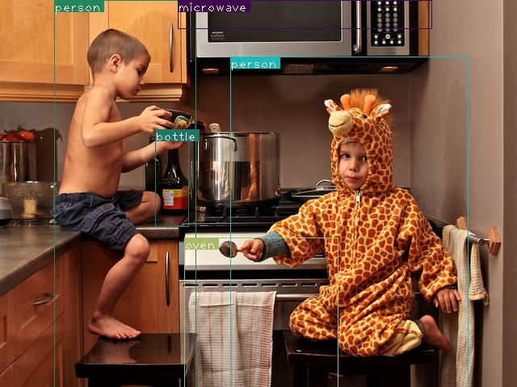

# Real-time object detection - YOLOv3 in PyTorch

This project is still under development.

## Table of Contents

* [Description](#description)
* [Installation](#installation)
* [Running the script](#running-the-script)
* [Demo](#demo)
* [Contributing](#contributing)

## Description

In this notebook, I’ll perform a full implementation of YOLOv3 in PyTorch based on the following materials:

* [Orginial implementation of darknet](https://github.com/pjreddie/darknet)
* [YOLOv3: An Incremental Improvement, Joseph Redmon, Ali Farhadi](https://pjreddie.com/media/files/papers/YOLOv3.pdf)
* [How to implement a YOLO (v3) object detector from scratch in PyTorch, Ayoosh Kathuria](https://blog.paperspace.com/how-to-implement-a-yolo-object-detector-in-pytorch/).

Example of image detection output:



## Installation

Project was created with Python 3.6.x and pyTorch 0.4.0.

Clone repository and install requirements:

```
git clone https://github.com/BarbaraStempien/DL--YOLO-Real-Time-Object-Detection.git
cd DL--YOLO-Real-Time-Object-Detection
pip3 install -r requirements.txt
```
Download YOLOv3 weights:

```
wget https://pjreddie.com/media/files/yolov3.weights
```
You can download different weights from the [YOLO website](https://pjreddie.com/darknet/yolo/).

## Running the script

### Run detection for images

```
python image_detection.py -h
```
`-h` allows you to look up all terminal flags

```
python image_detection.py --images imgs --det det 
```

`--images` flag defines the directory of your input images
`--det` flag defines the directory of your output imanges (directory to which images with detected objects will be saved)

```
python image_detection.py --images imgs --det det --reso 320
```
`--reso` flag allows you to change resolution of the input images, default value is 416. Number must be a multiple of 32 and greater than 32.

```
python image_detection.py --confidence 0.25
```
`--confidence` flag allows you to change confidence level. By default, model displays object detected with a confidence of 0.5 or higher.

### Run detection for video

```
python video_detection.py -h
```
`-h` flag allows you to look up all terminal flags defined.

```
python video_detection.py --video video/example.avi
```
`--video` flag defines the directory and name of your input video. Video must be in the the .avi format.

```
python video_detection.py
```
Run video detection script without a `--video` flag to use machine's default camera.

```
python video_detection.py --reso 320
```
`--reso` flag allows you to change resolution of the video, default value is 160.

```
python video_detection.py --confidence 0.25
```
`--confidence` flag allows you to change confidence level. By default, model displays object detected with a confidence of 0.5 or higher.

To stop web cam recording, press `Q` on the keyboard.

## Demo


## Contributing

If you want to contribute, check out [CONTRIBUTING.md](CONTRIBUTING.md).